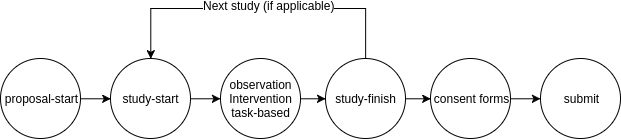

#########
Structure
#########

This Django project consists of ten apps that can be divided into three categories:

- Core
    - *etcl*: Main directory with settings and a WSGI configuration.
    - *core*: Core functionality, reusable models, views, forms and templates.

- Proposals
    - *proposals*: Main application that binds together all applications below. Allows participants to give general information on their study.
    - *studies*: Allows users to add more in-detail information on their study.
    - *observations*: Allows users to specify the observation part of their study (if applicable).
    - *interventions*: Allows users to specify the intervention part of their study (if applicable).
    - *tasks*: Allows users to specify tasks in their study (if applicable). Tasks can be grouped in one or more sessions.
    - *reviews*: Allows the committee to review proposals.

- Feedback
    - *feedback*: Allows users to give feedback on the application: with what parts did they struggle?
    - *faqs*: Provides users with answers to frequently asked questions about the application.

.. note::

    In the code a 'research project' is called a proposal, but this term is not used outside of development. Using this
    term near users can lead to some confused looks, be warned ;)

    It's generally safe to use the word 'study'.

Core
====

The core category contains most of the underlying code used in other apps. For example, it contains the base templates
for all other views and it's where most of the authentication code is located.

The :mod:`core` app contains only one model of it's own, the :class:`~core.models.Setting` model. (Setting as in
location, not preferences). This model is used by the :mod:`observations`, :mod:`interventions` and :mod:`tasks` apps.

Also included in :mod:`core.models` is an abstract model class, which adds the `settings` fields to a model. This is
used in the same apps as before.

See :mod:`core.utils`, :mod:`core.models`, :mod:`core.templatetags.core_filters` for other commonly used classes,
functions and methods.

Proposals Flow
==============

Creating
--------

When a researcher wants to submit a new proposal, (s)he starts in the :mod:`proposals` app. The forms in this app ask
for basic information about the study (title, researchers involved, funding, etc.). This information is stored in a
:class:`~proposals.models.Proposal` object, which also serves as the main object for the other objects.

While staying in the ``proposals`` app, the researcher has to specify the amount of studies that are part of this
proposal. (Please note that studies are called 'trajectories' in the interface).

The app then creates the apropiate :class:`~studies.models.Study` objects and hands over progress to the ``study``
app. This app itself only handles basic information about the participants. The researcher is also asked which of three
research types will be performed in this study. These types can be *observation*, *intervention* and *task-based*.

For every type selected a corresponding object will be created. These models are located in their respective apps, which
will also handle the forms for those models.

If the researcher has filled in all information about the research types, they will return to the ``study`` app to
finish up, after which they will either start anew with the next study, or be returned back to the ``proposals`` app,

There, they will be asked to supply the consent forms for each study. Consent forms are stored in a
:class:`~studies.models.Documents` object. An object should've been created for every study automatically. If needed,
researchers can supply additional consent forms. In that case, the system will create a new ``Documents`` object without
a reference to a study.

A warning about datamanagement is next, after which the researcher can submit it for review.

    A (very) simple illustration of the order in which a proposal is created

Reviewing
---------

